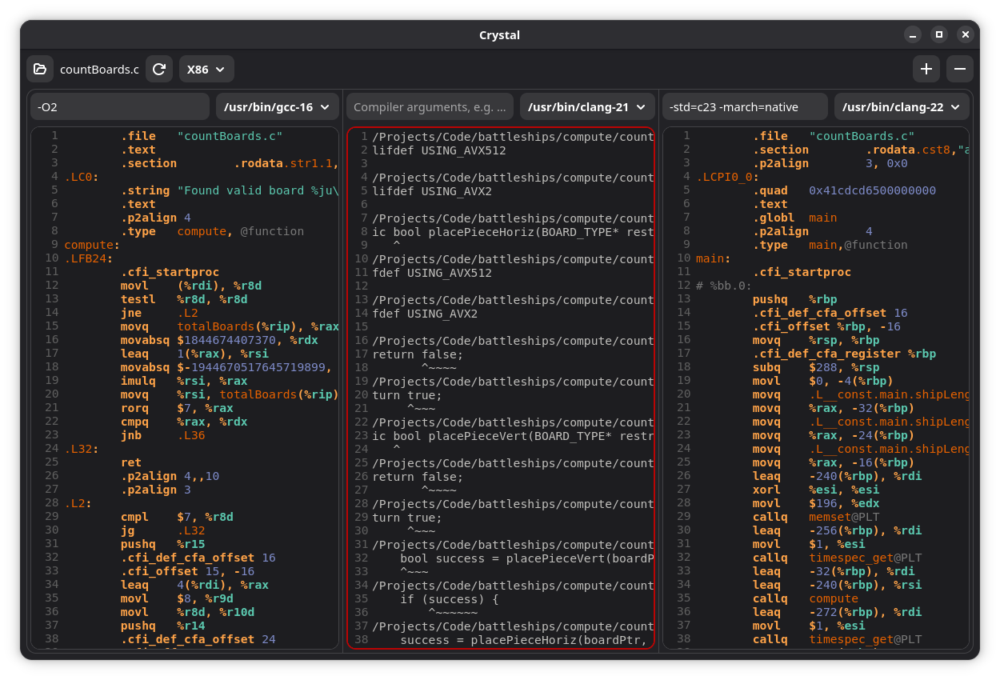

## Crystal
  - Inspect the assembly output from various compilers, locally
  - Syntax highlighting is best-effort and currently supports x86 and ARM
    - Pull requests are welcome for more ISAs, as well as improving the existing ones
  - It can detect `gcc`, `g++`, `clang`, `clang++`, AOMP and ICX / ICPX

## Building:
  - `make build`: Builds the program
    - Supports multiple threads with `-j[THREAD COUNT]`
    - Use `make -j$(nproc)` to build with all available threads
  - `make install`: Installs the program
  - `make uninstall`: Uninstalls the program
  - `make clean`: Cleans the build environment
  - `DEBUG=[true/false]`: Environment variable to enable debug support
    - Includes debug symbols, retains the frame pointer and enables sanitisers
    - `make debug` runs `make build` in debug mode
  - `BUILD_DIR`: Environment variable to configure built object output
  - `PREFIX_DIR`: Environment variable to configure the installation prefix
    - Defaults to `/usr/local`

## Usage:
  - A file to open to can optionally be supplied as the first argument
  - Compilers can only be detected if they're reachable from `$PATH`

### In-place:
  - `make build -j$(nproc)`
  - `./build/crystal [FILE]`

### System:
  - `make build -j$(nproc)`
  - `sudo make install`
  - `crystal [FILE]`

## Dependencies:
  - Package names are correct for Debian, other distros may vary

### Building:
  - `make`
  - `libadwaita-1-dev`
  - `libgtksourceview-5-dev`
  - `python3`
  - A C23 compatible compiler

### Runtime:
  - `libadwaita-1-0`
  - `libgtksourceview-5-0`

## Licence:
  - This project is available under the terms of the GPL-3.0 License
    - These terms can be found in `LICENCE.txt`
